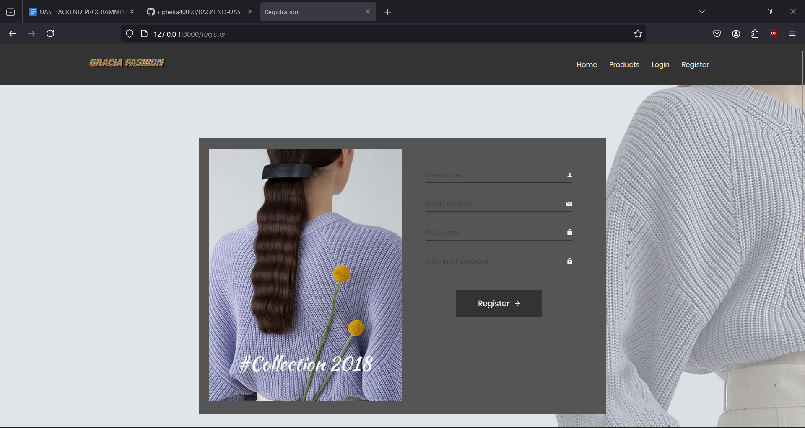

</a>

## Tentang Garcia Fashion

Di era digital saat ini, keberadaan toko online menjadi kebutuhan utama bagi banyak pelaku bisnis. Kemajuan teknologi informasi dan internet telah mengubah cara berbelanja dari metode tradisional menjadi lebih modern dan efisien melalui platform digital. Pembuatan website toko online memberikan kesempatan bagi perusahaan untuk memperluas pasar tanpa batasan geografis.

Proyek ini bertujuan untuk mengembangkan sebuah website toko online menggunakan PHP dan Laravel. PHP, sebagai salah satu bahasa pemrograman server-side yang paling populer, menawarkan fleksibilitas dan kemudahan dalam pengembangan web. Sementara itu, Laravel, sebagai framework PHP modern, menyediakan struktur dan fitur-fitur tambahan yang mempermudah pengembangan aplikasi web, termasuk routing, sesi, caching, dan otentikasi.

## Anggota Kelompok

Jason Wiedardi Limtara - 535220212        
Wilson Alfando - 535220219    
Benevito Kevin - 535220222    
Muhammad Raffi Hermawan - 535220259    

## Tampilan

